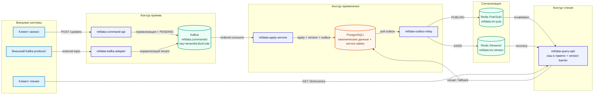
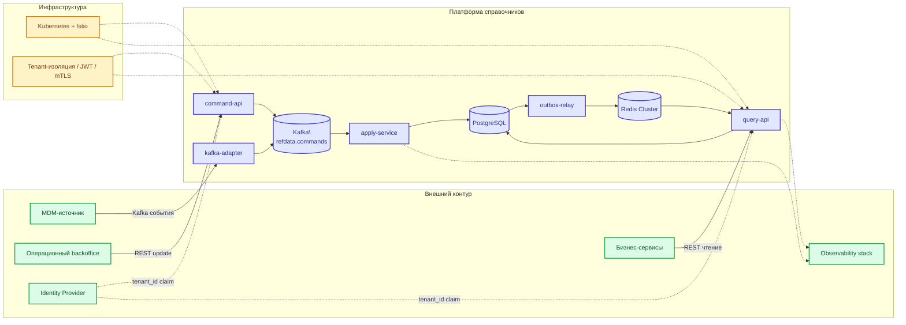
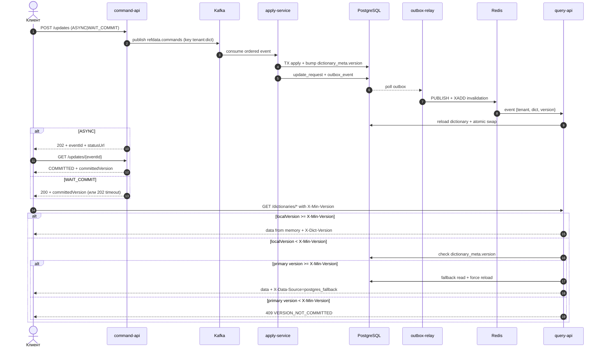
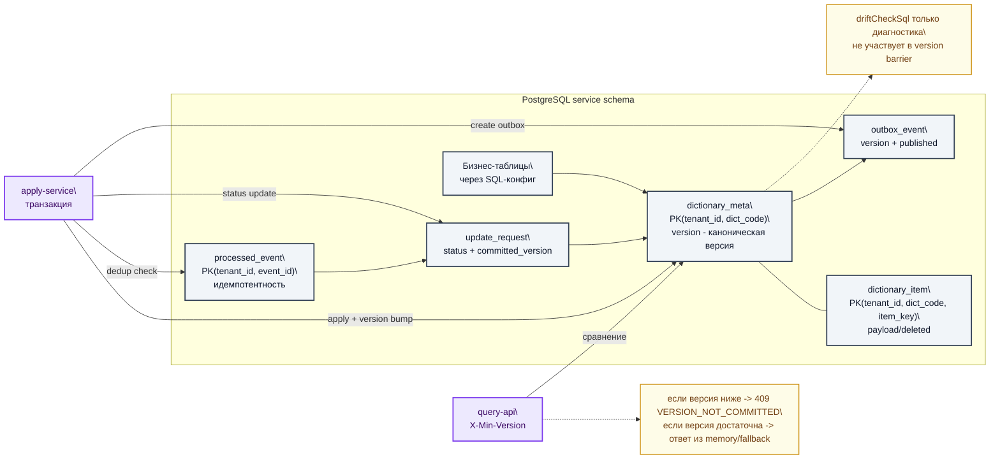
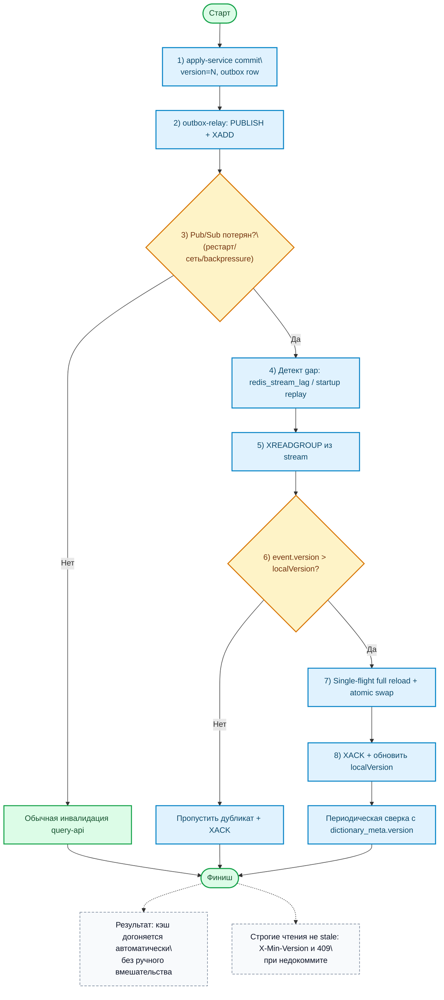
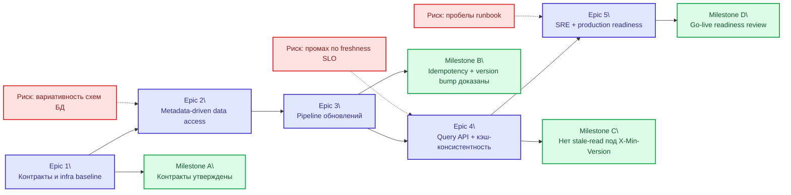

# Epic: Универсальная платформа справочников с мгновенным обновлением Pod-кэша

## 1. Итоговая задача

Разработать универсальную платформу хранения и выдачи справочников/словарей/параметров, которая:

1. Принимает изменения из двух источников:
   1. REST API.
   2. Kafka topic.
2. Поддерживает оба формата изменений:
   1. Полный слепок (`SNAPSHOT`).
   2. Частичное изменение (`DELTA`).
3. Отдает данные внешним системам по REST API с целевой нагрузкой до `2 000 000 TPS` за счет горизонтального масштабирования Pod-ов.
4. Гарантирует, что после записи в PostgreSQL данные становятся доступными через API в рамках SLA freshness (`p95 <= 300ms`, `p99 <= 1s`), а для строгого сценария read-after-write поддерживается версионный барьер по подтвержденной (`committed`) версии.
5. Не зависит от конкретной структуры БД:
   1. Подключается к любой PostgreSQL.
   2. Кэшируемые справочники полностью задаются конфигурацией.
   3. В коде нет хардкода бизнес-таблиц конкретной БД.
6. Использует `Redis Cluster` только как in-memory механизм мгновенного оповещения и восстановления пропущенных событий инвалидации кэша.

---

## 2. Scope и ограничения

1. Стек: `Kubernetes`, `Istio`, `Apache Kafka`, `PostgreSQL`, `Redis Cluster`, `Java/Kotlin`.
2. Источник истины для данных: `PostgreSQL`.
3. Локальный кэш в Pod: in-memory (`immutable map` + atomic swap).
4. Redis не используется как каноническое хранилище справочников.
5. Сервис должен быть multi-tenant-ready:
   1. `tenantId` обязателен в REST/Kafka/Redis контрактах и в ключах таблиц платформы.
   2. Изоляция кэша и версий выполняется по паре `(tenantId, dictCode)`.
6. UI/экраны не входят в scope данного ТЗ; документ описывает backend API и интеграционные контракты платформы.

---

## 3. Архитектурные компоненты

1. `refdata-command-api`
   1. Принимает `POST /v1/tenants/{tenantId}/updates`.
   2. Поддерживает режимы `consistencyMode=ASYNC|WAIT_COMMIT`.
   3. Валидирует контракт, tenant-контекст и ограничения размера payload.
   4. Создает/обновляет `update_request` и публикует событие в `Kafka: refdata.commands`.
   5. Отдает `GET /v1/tenants/{tenantId}/updates/{eventId}` (статус `PENDING|COMMITTED|FAILED`).
2. `refdata-kafka-adapter`
   1. Подписывается на внешний topic.
   2. Нормализует вход в единый контракт и проставляет `tenantId`.
   3. Публикует в `refdata.commands` с key=`{tenantId}:{dictCode}`.
3. `refdata-apply-service`
   1. Читает `refdata.commands` в порядке partition-offset.
   2. Идемпотентно применяет изменения в PostgreSQL.
   3. Обновляет каноническую версию `dictionary_meta.version`.
   4. Обновляет статус `update_request` (`COMMITTED|FAILED`).
   5. Пишет событие в outbox.
4. `refdata-outbox-relay`
   1. Читает outbox после commit.
   2. Публикует инвалидацию в Redis:
      1. `PUBLISH refdata:inv:pub` для мгновенной реакции.
      2. `XADD refdata:inv:stream` для recovery.
5. `refdata-query-api`
   1. Держит локальный in-memory кэш на Pod.
   2. Отдает REST-чтения из памяти.
   3. При инвалидации делает `full reload` измененного справочника из PostgreSQL и атомарный swap.
6. `PostgreSQL`
   1. Канонические данные + версия + идемпотентность + статус обновлений + outbox.
7. `Redis Cluster`
   1. Только сигнализация изменений и механизм догоняния.

### 3.1 Архитектурная схема сервиса



Форматы: [SVG](./refdata-architecture.svg) | [PlantUML](./refdata-architecture.puml)

### 3.2 Дополнительные схемы для ролей

#### Для аналитиков: Контекст системы



Форматы: [SVG](./refdata-context.svg) | [PlantUML](./refdata-context.puml)

#### Для аналитиков: Последовательность записи/чтения



Форматы: [SVG](./refdata-write-read-sequence.svg) | [PlantUML](./refdata-write-read-sequence.puml) | [Mermaid source](./refdata-write-read-sequence.mmd)

#### Для лидера АС: Модель данных и версия консистентности



Форматы: [SVG](./refdata-version-model.svg) | [PlantUML](./refdata-version-model.puml)

#### Для лидера АС: Поток отказа/восстановления



Форматы: [SVG](./refdata-recovery.svg) | [PlantUML](./refdata-recovery.puml)

#### Для стрим-лида: Карта зависимостей эпиков



Форматы: [SVG](./refdata-delivery-plan.svg) | [PlantUML](./refdata-delivery-plan.puml)

---

## 4. Принцип независимости от структуры БД (обязательное требование)

Реализация строится как metadata-driven.

1. Вводится абстракция `DictionaryProvider`:
   1. `loadAll(tenantId, dictCode): Map<String, JsonNode>`
   2. `getCommittedVersion(tenantId, dictCode): Long`
   3. `applyDelta(tenantId, dictCode, event): ApplyResult` (если сервис применяет записи в целевую БД)
2. Базовая реализация: `PostgresSqlProvider`.
3. Для каждого справочника в конфиге задаются SQL и правила загрузки/записи.
4. Требование к `loadSql`: обязательно возвращает:
   1. `k` — ключ записи.
   2. `v` — `json/jsonb` payload.
5. Для write-path в конфиге задаются шаблоны:
   1. `upsertSql` (для `DELTA` + `UPSERT`).
   2. `deleteSql` (для `DELTA` + `DELETE`).
   3. `snapshotReplaceSql` или пара `snapshotStageSql/snapshotFinalizeSql` (для `SNAPSHOT`).
6. Если SQL-шаблоны записи не заданы, справочник считается read-only для входящих обновлений.
7. Каноническая версия для барьера консистентности — только `dictionary_meta.version`.
8. `driftCheckSql` (бывший `versionSql`) может использоваться только для диагностики расхождений, не для принятия решений read-after-write.
9. Добавление нового справочника не требует изменений в коде и пересборки сервиса (достаточно обновить конфигурацию и выполнить rolling restart/горячую перезагрузку конфигурации).

---

## 5. Конфигурационная модель (пример)

```yaml
refdata:
  postgres:
    jdbcUrl: jdbc:postgresql://pg-host:5432/app
    username: app_user
    passwordFromEnv: PG_PASSWORD
    schema: public
    pool:
      maxSize: 50

  consistency:
    waitCommitTimeoutMs: 300

  security:
    tenant:
      source: JWT_CLAIM
      claim: tenant_id
      allowHeaderOverrideForTrustedClients: false

  kafka:
    commandsTopic: refdata.commands
    keyTemplate: "{tenantId}:{dictCode}"

  redis:
    mode: cluster
    nodes:
      - redis-0:6379
      - redis-1:6379
      - redis-2:6379
    pubChannel: refdata:inv:pub
    streamKey: refdata:inv:stream
    consumerGroup: refdata-query-pods

  dictionaries:
    - code: COUNTRY
      enabled: true
      loadSql: |
        select code as k, to_jsonb(t) as v
        from mdm_country t
        where t.tenant_id = :tenantId and t.deleted = false
      driftCheckSql: |
        select coalesce(max(updated_at_epoch),0)::bigint as version
        from mdm_country
        where tenant_id = :tenantId
      apply:
        mode: SQL_TEMPLATE
        upsertSql: |
          insert into mdm_country(tenant_id, code, name, updated_at_epoch, deleted)
          values (:tenantId, :key, cast(:payload->>'name' as text), :eventEpoch, false)
          on conflict (tenant_id, code) do update
          set name = excluded.name,
              updated_at_epoch = excluded.updated_at_epoch,
              deleted = false
        deleteSql: |
          update mdm_country
          set deleted = true,
              updated_at_epoch = :eventEpoch
          where tenant_id = :tenantId
            and code = :key
        snapshotStrategy: FULL_REPLACE
        snapshotReplaceSql: |
          select refdata_replace_country_snapshot(:tenantId, :snapshotJson)
      reloadOnEvent: FULL

    - code: CURRENCY
      enabled: true
      loadSql: |
        select ccy as k,
               jsonb_build_object('name', name, 'digits', digits) as v
        from mdm_currency
        where tenant_id = :tenantId and deleted = false
      driftCheckSql: |
        select coalesce(max(version),0)::bigint
        from mdm_currency
        where tenant_id = :tenantId
      apply:
        mode: SQL_TEMPLATE
        upsertSql: |
          insert into mdm_currency(tenant_id, ccy, name, digits, version, deleted)
          values (
            :tenantId,
            :key,
            cast(:payload->>'name' as text),
            cast(:payload->>'digits' as int),
            :eventVersion,
            false
          )
          on conflict (tenant_id, ccy) do update
          set name = excluded.name,
              digits = excluded.digits,
              version = excluded.version,
              deleted = false
        deleteSql: |
          update mdm_currency
          set deleted = true,
              version = :eventVersion
          where tenant_id = :tenantId
            and ccy = :key
        snapshotStrategy: FULL_REPLACE
        snapshotReplaceSql: |
          select refdata_replace_currency_snapshot(:tenantId, :snapshotJson)
      reloadOnEvent: FULL
```

Примечание к `snapshotReplaceSql`: ожидается, что вызываемая функция/скрипт выполняет загрузку snapshot в staging и атомарный swap/replace прод-таблицы в одной транзакции.

---

## 6. Потоки данных

### 6.0 Гарантия порядка

1. Kafka key для команд обязателен: `{tenantId}:{dictCode}`.
2. Все события для одной пары `(tenantId, dictCode)` попадают в один partition и обрабатываются последовательно.
3. Для источников, где возможна конкурирующая запись, рекомендуется передавать `sourceRevision`; событие с устаревшей ревизией отклоняется как stale.

### 6.1 Запись

1. Событие приходит через REST или внешний Kafka.
2. `command-api`/`kafka-adapter` нормализует событие, проставляет `tenantId`, создает `update_request(status=PENDING)`.
3. Нормализованное событие попадает в `Kafka refdata.commands`.
4. Ответ на запись:
   1. `ASYNC` -> `202 Accepted` + `eventId` + `statusUrl`.
   2. `WAIT_COMMIT` -> ожидание до `waitCommitTimeoutMs`; при commit возвращается `200` + `committedVersion`, при timeout — `202`.
5. `apply-service` в транзакции:
   1. Проверяет дедупликацию `(tenant_id, event_id)`.
   2. Проверяет порядок/стухание по `sourceRevision` (если поле задано).
   3. Для `SNAPSHOT`:
      1. Собирает chunk-и в staging (по `snapshotId`) до `chunksTotal`.
      2. Выполняет `snapshotReplace` в одной транзакции: загрузка staging → полная замена прод-данных → обновление `dictionary_meta.version`.
      3. Публикует версию/outbox только после успешного commit replace.
   4. Для `DELTA` применяет операции и обновляет `dictionary_meta.version` в той же транзакции.
   5. Обновляет `update_request` (`COMMITTED` + `committed_version` либо `FAILED`).
   6. Пишет запись в outbox.
6. `outbox-relay` публикует Redis-событие инвалидации (`Pub/Sub` + `Streams`).

### 6.2 Чтение

1. `query-api` читает из локальной памяти по ключу `(tenantId, dictCode)`.
2. При событии `{tenantId, dictCode, version}`:
   1. Сравнивает с `localVersion`.
   2. Если версия новее — запускает single-flight `full reload`.
   3. После загрузки делает atomic swap.
3. Если Pod пропустил Pub/Sub, догоняет из stream и сверкой версий.
4. Периодическая фоновая сверка использует `dictionary_meta.version` как источник истины; `driftCheckSql` применяется только для диагностики.

---

## 7. Актуальность данных: строгая модель

Для сценариев, где требуется read-after-write без stale read:

1. Клиент отправляет запись в одном из режимов:
   1. `WAIT_COMMIT`: получает `committedVersion` только если update реально закоммичен.
   2. `ASYNC`: получает `eventId` и читает `committedVersion` через `GET /v1/tenants/{tenantId}/updates/{eventId}` после статуса `COMMITTED`.
2. На чтение клиент передает `X-Min-Version`, полученный только из committed-ответа.
3. `query-api`:
   1. Если `localVersion >= X-Min-Version` — отдает из памяти.
   2. Если нет — кратко ждет завершения reload (`<=100ms`, настраиваемо).
   3. Если timeout — читает `dictionary_meta.version` в primary:
      1. Если `version >= X-Min-Version` — читает данные из primary, инициирует принудительный reload.
      2. Если `version < X-Min-Version` — возвращает `409 VERSION_NOT_COMMITTED` без отдачи данных.
4. Ответ содержит:
   1. `X-Dict-Version`
   2. `X-Data-Source: memory|postgres_fallback`

Это обязательный механизм для гарантии актуальности при распределенном кэше.

---

## 8. Контракты событий

### 8.1 Команда (Kafka `refdata.commands`)

```json
{
  "eventId": "uuid",
  "tenantId": "tenant-a",
  "source": "REST|KAFKA",
  "dictCode": "COUNTRY",
  "eventType": "SNAPSHOT|DELTA",
  "sourceRevision": 987654321,
  "snapshotId": "uuid-or-null",
  "chunkIndex": 1,
  "chunksTotal": 1,
  "occurredAt": "2026-02-27T12:00:00Z",
  "items": [
    {
      "key": "RU",
      "op": "UPSERT|DELETE",
      "payload": { "name": "Russia" }
    }
  ]
}
```

Правила:

1. Kafka message key обязателен: `{tenantId}:{dictCode}`.
2. `SNAPSHOT` имеет семантику полного замещения набора ключей для `(tenantId, dictCode)`:
   1. Ключи, отсутствующие в snapshot, считаются удаленными.
   2. Для `chunksTotal > 1` публикация новой версии выполняется только после получения и атомарной сборки всех chunk-ов.
3. `sourceRevision`, `snapshotId`, `chunkIndex`, `chunksTotal` — опциональные поля:
   1. Для `DELTA` поля snapshot могут отсутствовать.
   2. Для chunked `SNAPSHOT` поля `snapshotId/chunkIndex/chunksTotal` обязательны.
4. `snapshotReplace` обязан быть атомарным: сборка chunk-ов в staging + полная замена прод-таблицы выполняются в одной транзакции; версия публикуется только после commit.

### 8.2 Инвалидация (Redis Pub/Sub + Stream)

```json
{
  "eventId": "uuid",
  "tenantId": "tenant-a",
  "dictCode": "COUNTRY",
  "version": 1042,
  "committedAt": "2026-02-27T12:00:01Z"
}
```

---

## 9. Схема PostgreSQL (техническая)

1. `dictionary_meta(tenant_id, dict_code, version bigint not null, last_source_revision bigint null, updated_at timestamptz not null, primary key(tenant_id, dict_code))`
2. `dictionary_item(tenant_id, dict_code, item_key, payload jsonb, deleted boolean, updated_at timestamptz, primary key(tenant_id, dict_code, item_key))`
3. `processed_event(tenant_id, event_id, source, processed_at, primary key(tenant_id, event_id))`
4. `update_request(tenant_id, event_id, dict_code, status text, committed_version bigint null, error_message text null, created_at timestamptz not null, updated_at timestamptz not null, primary key(tenant_id, event_id))`
5. `outbox_event(id bigserial pk, tenant_id, event_id, dict_code, version, payload jsonb, created_at, published boolean default false)`

Примечание:

1. Если справочники физически хранятся в других таблицах, перечисленные таблицы остаются служебными таблицами платформы.
2. Каноническая версия для API-барьера хранится только в `dictionary_meta.version`.

---

## 10. REST API

1. `POST /v1/tenants/{tenantId}/updates?consistencyMode=ASYNC|WAIT_COMMIT[&timeoutMs=50..1000]`
   1. `ASYNC` -> `202 Accepted` + `eventId` + `statusUrl`.
   2. `WAIT_COMMIT` -> `200 OK` + `committedVersion` либо `202 Accepted` при timeout.
2. `GET /v1/tenants/{tenantId}/updates/{eventId}` -> `PENDING|COMMITTED|FAILED`.
3. `GET /v1/tenants/{tenantId}/dictionaries/{dictCode}/items/{key}`
4. `GET /v1/tenants/{tenantId}/dictionaries/{dictCode}/items?keys=k1,k2,...`
5. `GET /v1/tenants/{tenantId}/dictionaries/{dictCode}/all` (paging/streaming для больших справочников)
6. `GET /v1/tenants/{tenantId}/dictionaries/{dictCode}/version`
7. `GET /actuator/health`
8. `GET /actuator/prometheus`

---

## 11. Нефункциональные требования

1. Производительность:
   1. Горизонтальное масштабирование query-api до целевой нагрузки `2 000 000 TPS` суммарно по Pod.
   2. Целевые задержки (из memory): `p95 <= 10ms`, `p99 <= 25ms`.
2. Freshness:
   1. `p95` время распространения изменения до Pod-кэшей `<= 300ms`.
   2. `p99 <= 1s`.
3. Отказоустойчивость:
   1. Не менее 3 реплик сервисов.
   2. PodDisruptionBudget.
   3. Anti-affinity.
4. Безопасность:
   1. mTLS через Istio.
   2. JWT/mTLS для внешних клиентов.
   3. Secret management через K8s secrets.
   4. Жесткая tenant-изоляция: запрос с `tenantId`, не совпадающим с auth-контекстом, отклоняется (`403`).
5. Наблюдаемость:
   1. Метрики: `dict_version_lag`, `cache_reload_duration`, `cache_reload_errors`, `redis_stream_lag`, `kafka_consumer_lag`, `postgres_fallback_reads`.
   2. Трейсинг: OpenTelemetry.
   3. Логи: structured, обязательные поля `eventId`, `dictCode`, `version`, `source`.
6. Хостинг и инфраструктура:
   1. Развертывание только в `Kubernetes` (не ниже `v1.28`), минимум 3 worker-ноды.
   2. Прод-кластер должен быть распределен минимум по 2 failure-domain (AZ/стойки).
   3. Для `PostgreSQL` и `Redis` обязательно SSD-хранилище.
   4. Резервирование `PostgreSQL`: регулярные base backup + WAL archiving (PITR).
   5. Целевые параметры восстановления: `RPO <= 15m`, `RTO <= 60m`.

---

## 12. Обязательные защитные механизмы

1. `single-flight` reload на `(tenantId, dictCode)` в рамках Pod.
2. Debounce/coalesce инвалидаций по `(tenantId, dictCode)` (окно 20-80ms, настраиваемо).
3. Jitter при массовом reload между Pod-ами (0-50ms).
4. Ограничение параллельных reload в Pod.
5. Recovery из Redis Streams через `XREADGROUP` + `XACK`.
6. Периодическая фоновая сверка версий из `dictionary_meta.version`; `driftCheckSql` — только диагностика.
7. Идемпотентность через `processed_event(tenant_id, event_id)`.
8. Таймауты и circuit breaker (Istio + клиентские).
9. Гарантия порядка через Kafka key=`{tenantId}:{dictCode}` и последовательную обработку в рамках partition.
10. Для chunked `SNAPSHOT` запрещена частичная публикация: новая версия публикуется только после полной сборки snapshot.

---

## 13. План реализации для команды Codex

### Epic 1: Контракты и инфраструктурная основа

1. Описать OpenAPI для REST.
2. Зафиксировать JSON schema для Kafka/Redis событий.
3. Подготовить Helm values для PostgreSQL/Kafka/Redis подключений.

### Epic 2: Универсальный data-access слой

1. Реализовать `DictionaryProvider` SPI.
2. Реализовать `PostgresSqlProvider` с поддержкой конфигурируемых SQL.
3. Покрыть интеграционными тестами две разные схемы PostgreSQL.

### Epic 3: Pipeline обновлений

1. `command-api` + `kafka-adapter`.
2. `apply-service` с SNAPSHOT/DELTA, dedup и versioning.
3. Outbox и relay в Redis Pub/Sub + Streams.

### Epic 4: Query API и локальный кэш Pod

1. In-memory store (immutable map).
2. Full reload + atomic swap.
3. Version barrier (`X-Min-Version`) + fallback в PostgreSQL.

### Epic 5: Production readiness

1. Метрики, дашборды, алерты.
2. Load test и failover test.
3. Runbook и SRE checklist.

---

## 14. Definition of Done

1. Новый справочник подключается только конфигурацией, без изменения кода.
2. Один и тот же артефакт сервиса работает минимум с двумя разными структурами PostgreSQL.
3. При потере Pub/Sub сообщений система корректно догоняет изменения через Streams.
4. Для запроса с `X-Min-Version` сервис не возвращает версию ниже запрошенной (или возвращает `409 VERSION_NOT_COMMITTED`).
5. На нагрузочных тестах подтверждена горизонтальная масштабируемость до целевых значений.
6. Подготовлены эксплуатационные артефакты: dashboards, alerts, runbook.
7. Multi-tenant изоляция подтверждена тестами (`tenantId` во всех контрактах и ключах БД).

---

## 15. Проверка ТЗ на соответствие исходным требованиям

1. Обновления по REST и Kafka: **предусмотрено**.
2. Поддержка SNAPSHOT и DELTA: **предусмотрено** (включая явную семантику полного замещения для SNAPSHOT).
3. Выдача данных внешним системам по REST: **предусмотрено**.
4. Нагрузка 2 000 000 TPS через масштабирование Pod-ов: **заложено архитектурно** (memory-first read path + stateless scaling).
5. Доступность новых данных сразу после записи в PostgreSQL: **предусмотрено** через инвалидацию + version barrier + fallback.
6. Redis Cluster как механизм уведомления об изменениях и не как источник истины: **предусмотрено**.
7. Подключение к любой PostgreSQL и независимость от схемы: **предусмотрено** через `DictionaryProvider` + SQL-конфигурации справочников (read и write).
8. Multi-tenant изоляция: **предусмотрено** во всех контрактах и служебных таблицах.
9. Конфликт `202 Accepted` vs `committedVersion`: **устранен** через режимы `ASYNC|WAIT_COMMIT` и endpoint статуса.
10. Канонический источник версии для барьера: **зафиксирован** (`dictionary_meta.version`).

Итог: ТЗ приведено к внутренне непротиворечивому виду и готово к декомпозиции в backlog.

---

## 16. Формализованные сценарии использования (Use Cases)

### UC-01: Асинхронное обновление справочника через REST

1. Актор: внешняя система-источник данных.
2. Предусловия:
   1. Клиент аутентифицирован, `tenantId` валиден.
   2. `dictCode` включен в конфигурации.
3. Основной поток:
   1. Клиент вызывает `POST /v1/tenants/{tenantId}/updates?consistencyMode=ASYNC`.
   2. `command-api` валидирует payload и публикует событие в `Kafka refdata.commands`.
   3. Клиент получает `202 Accepted` + `eventId` + `statusUrl`.
   4. `apply-service` применяет изменения и фиксирует `committedVersion`.
   5. Клиент читает статус через `GET /v1/tenants/{tenantId}/updates/{eventId}` и получает `COMMITTED`.
4. Альтернативы/ошибки:
   1. Невалидный контракт -> `400`.
   2. Нарушение tenant-изоляции -> `403`.
   3. Внутренняя ошибка применения -> статус `FAILED` в `update_request`.

### UC-02: Запись с ожиданием commit (строгая консистентность)

1. Актор: внешняя система, требующая read-after-write.
2. Предусловия:
   1. Те же, что в UC-01.
   2. Клиент задает `consistencyMode=WAIT_COMMIT`.
3. Основной поток:
   1. Клиент вызывает `POST /v1/tenants/{tenantId}/updates?consistencyMode=WAIT_COMMIT`.
   2. Сервис ждет commit до `waitCommitTimeoutMs`.
   3. При успехе возвращает `200` + `committedVersion`.
   4. Клиент использует `X-Min-Version=committedVersion` в последующем чтении.
4. Альтернативы/ошибки:
   1. Commit не успел в timeout -> `202 Accepted` + `eventId` + `statusUrl`.
   2. Ошибка применения -> `FAILED` в статусе события.

### UC-03: Чтение по version barrier

1. Актор: внешний клиент чтения.
2. Предусловия:
   1. Клиент знает целевую `X-Min-Version`.
3. Основной поток:
   1. Клиент вызывает `GET /v1/tenants/{tenantId}/dictionaries/{dictCode}/items/{key}` с `X-Min-Version`.
   2. Если `localVersion >= X-Min-Version`, данные возвращаются из памяти.
   3. Если нет, сервис кратко ждет reload и проверяет `dictionary_meta.version` в primary.
   4. Если `dictionary_meta.version >= X-Min-Version`, сервис читает из primary и инициирует reload.
4. Альтернативы/ошибки:
   1. Если `dictionary_meta.version < X-Min-Version`, вернуть `409 VERSION_NOT_COMMITTED`.

### UC-04: Прием обновлений из внешнего Kafka

1. Актор: внешний Kafka producer.
2. Предусловия:
   1. Подключен `refdata-kafka-adapter`.
   2. Сообщение содержит `tenantId`, `dictCode`, `eventType`.
3. Основной поток:
   1. Адаптер читает внешний topic и нормализует контракт.
   2. Адаптер публикует в `refdata.commands` с key=`{tenantId}:{dictCode}`.
   3. Дальнейшая обработка идентична UC-01.
4. Альтернативы/ошибки:
   1. Устаревшая `sourceRevision` -> событие отклоняется как stale.

### UC-05: Восстановление после потери Pub/Sub

1. Актор: `query-api` Pod.
2. Предусловия:
   1. Pod пропустил часть Pub/Sub сообщений.
3. Основной поток:
   1. Pod читает пропущенные инвалидации из Redis Stream (`XREADGROUP`).
   2. Сравнивает полученную версию с локальной.
   3. Выполняет single-flight `full reload` и atomic swap.
   4. Подтверждает обработку (`XACK`).
4. Результат:
   1. Локальный кэш догоняет актуальную committed-версию без ручного вмешательства.

---

## 17. Тестовые сценарии приемки

1. `AT-01 ASYNC write accepted`
   1. Шаги: отправить `POST .../updates?consistencyMode=ASYNC`.
   2. Ожидание: `202` + `eventId`; затем `GET .../updates/{eventId}` -> `COMMITTED` и не-null `committedVersion`.
2. `AT-02 WAIT_COMMIT success`
   1. Шаги: отправить `POST .../updates?consistencyMode=WAIT_COMMIT`.
   2. Ожидание: `200` + `committedVersion`; чтение с `X-Min-Version` не ниже барьера.
3. `AT-03 WAIT_COMMIT timeout fallback`
   1. Шаги: искусственно замедлить apply и вызвать `WAIT_COMMIT`.
   2. Ожидание: `202`, позже статус `COMMITTED`.
4. `AT-04 Version barrier not committed`
   1. Шаги: вызвать чтение с `X-Min-Version`, который выше `dictionary_meta.version`.
   2. Ожидание: `409 VERSION_NOT_COMMITTED`.
5. `AT-05 Snapshot full replace semantics`
   1. Шаги: загрузить `SNAPSHOT` с неполным набором ключей.
   2. Ожидание: ключи, отсутствующие в snapshot, считаются удаленными после commit.
6. `AT-06 Chunked snapshot atomicity`
   1. Шаги: отправить `SNAPSHOT` в нескольких chunk-ах.
   2. Ожидание: до получения всех chunk-ов новая версия не публикуется; после commit видна только целостная версия.
7. `AT-07 Stream recovery`
   1. Шаги: отключить подписку Pub/Sub, произвести обновления, восстановить Pod.
   2. Ожидание: догон через Stream и достижение актуальной версии.
8. `AT-08 Performance read path`
   1. Шаги: нагрузочный тест чтения из memory.
   2. Ожидание: `p95 <= 10ms`, `p99 <= 25ms`, масштабирование до целевых TPS.
9. `AT-09 Freshness propagation`
   1. Шаги: серия обновлений с измерением времени до появления в Pod-кэше.
   2. Ожидание: `p95 <= 300ms`, `p99 <= 1s`.
10. `AT-10 Tenant isolation`
    1. Шаги: выполнить запрос с `tenantId`, не совпадающим с auth claim.
    2. Ожидание: `403`.

---

## 18. Глоссарий

1. `Dictionary` — логический справочник, идентифицируемый парой `(tenantId, dictCode)`.
2. `DELTA` — частичное изменение набора записей (`UPSERT|DELETE`).
3. `SNAPSHOT` — полное замещение набора записей справочника.
4. `Committed version` — версия, зафиксированная в `dictionary_meta.version` после commit транзакции.
5. `Version barrier` (`X-Min-Version`) — минимально допустимая версия данных в ответе чтения.
6. `Stale read` — чтение данных версии ниже требуемой клиентом.
7. `Single-flight reload` — ограничение, при котором одновременно выполняется не более одного reload для одного `(tenantId, dictCode)` в Pod.
8. `Atomic swap` — атомарная замена ссылки на локальный in-memory кэш после полной загрузки.
9. `Outbox pattern` — публикация внешних событий через таблицу outbox в той же транзакции, что и изменения данных.
10. `Drift` — расхождение между бизнес-данными справочника и служебной мета-версией.

---

## 19. Матрица трассируемости критериев

1. Функциональные требования:
   1. Функционал экранов/страниц: `N/A` (backend-only), зафиксировано в Scope.
   2. Сценарии использования (Use Cases): раздел 16.
   3. Понятный поток ввода/обработки/вывода: разделы 6, 7, 10.
   4. Нефункциональные требования: разделы 11, 12.
2. Технические требования и ограничения:
   1. Стек технологий: раздел 2.
   2. Хостинг/сервер: раздел 11 (пункт 6).
   3. Интеграции с внешними системами (API/Kafka/Redis): разделы 3, 8, 10.
3. Критерии приемки:
   1. Как понять, что работа выполнена: раздел 14.
   2. Измеримые показатели: раздел 11.
   3. Тестовые сценарии: раздел 17.
4. Структура и ясность:
   1. Однозначность терминов: раздел 18.
   2. Проверка на противоречия: разделы 15, 16, 17.
   3. Глоссарий: раздел 18.
