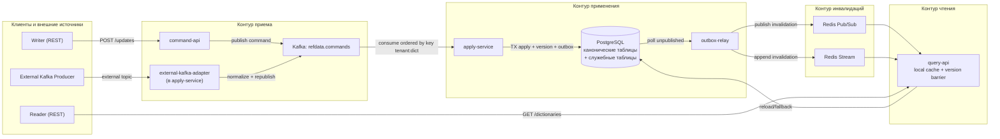
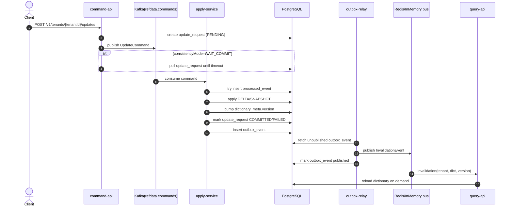
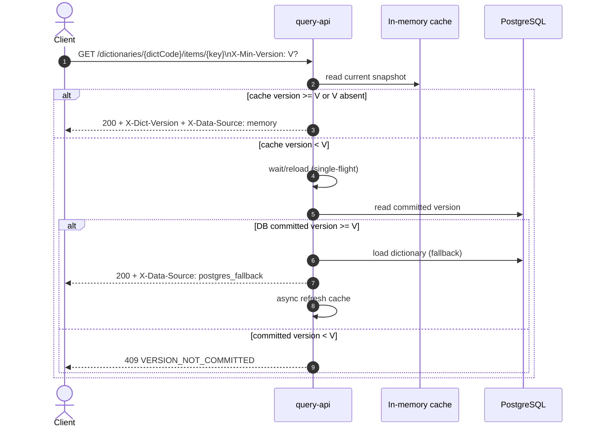
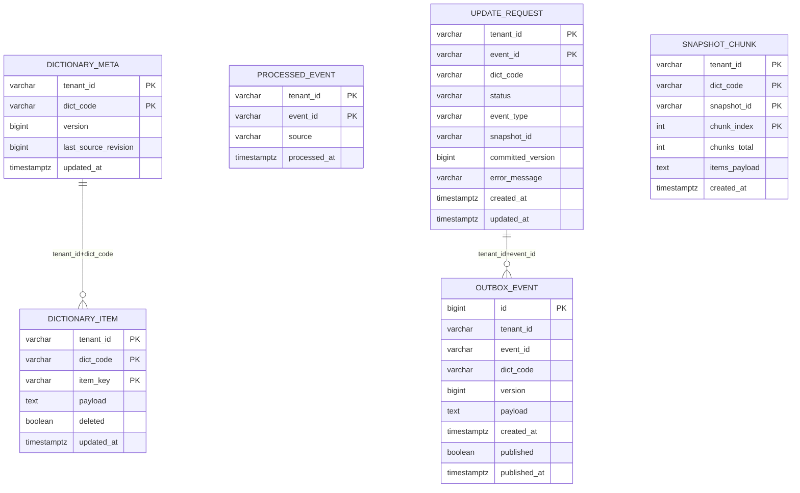
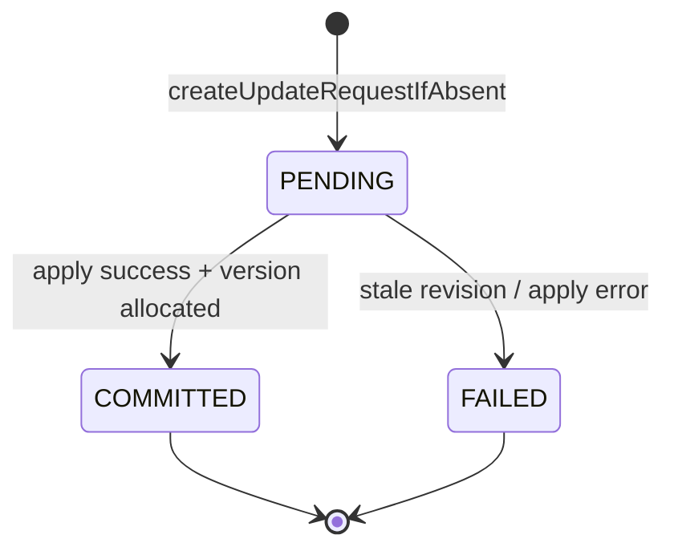

# Итоговое решение RefData Platform

## 1. Назначение

`RefData Platform` реализует универсальную backend-платформу справочников с двумя контурами:

- запись изменений (`DELTA`/`SNAPSHOT`) через REST и Kafka,
- чтение справочников через REST с in-memory кэшем и version barrier.

Канонический источник данных: `PostgreSQL`.
Redis используется только для мгновенных инвалидаций и восстановления пропущенных сигналов.

## 2. Состав решения

| Компонент | Роль (`refdata.role`) | Назначение |
|---|---|---|
| `command-api-app` | `command-api` | Прием `POST /updates`, создание `update_request`, публикация команд |
| `apply-service-app` | `apply-service` | Последовательное применение команд, версия, outbox |
| `query-api-app` | `query-api` | REST-чтение из Pod-кэша, `X-Min-Version`, fallback в PostgreSQL |
| `outbox-relay-app` | `outbox-relay` | Релей `outbox_event` в invalidation bus |
| `refdata-shared` | общая библиотека | Домен, persistence, сервисы, Flyway-миграции, API-контроллеры |

## 3. Архитектура взаимодействия



## 4. Поток записи

### 4.1 Последовательность



### 4.2 Внутренний алгоритм `apply-service`

1. Валидирует `dictCode` через `DictionaryRegistry`.
2. Гарантирует идемпотентность через `processed_event (tenant_id, event_id)`.
3. Отбрасывает устаревшие ревизии (`sourceRevision <= last_source_revision`) со статусом `FAILED`.
4. Для chunked `SNAPSHOT` сохраняет части в `snapshot_chunk` и применяет только после полной сборки.
5. Аллоцирует новую committed-версию в `dictionary_meta.version`.
6. Применяет:
   - `DELTA`: UPSERT/DELETE по SQL-шаблонам или generic fallback,
   - `SNAPSHOT`: `snapshotReplaceSql` (если задан) или full replace в `dictionary_item`.
7. Пишет `outbox_event` в той же транзакции, что и данные.

### 4.3 Режимы консистентности write API

| Режим | Поведение ответа `POST /updates` |
|---|---|
| `ASYNC` | Всегда `202 Accepted`, `status=PENDING`, клиент проверяет `GET /updates/{eventId}` |
| `WAIT_COMMIT` | `200 OK`, если за `timeoutMs` получен `COMMITTED`; иначе `202 Accepted` |

## 5. Поток чтения и version barrier



### 5.1 Заголовки чтения

- `X-Min-Version` (request): минимально допустимая версия данных.
- `X-Dict-Version` (response): версия данных, реально отданная в ответе.
- `X-Data-Source` (response): `memory` или `postgres_fallback`.

## 6. Модель данных PostgreSQL

### 6.1 Таблицы

| Таблица | Назначение |
|---|---|
| `dictionary_meta` | Текущая committed-версия и `last_source_revision` по `(tenant_id, dict_code)` |
| `dictionary_item` | Универсальное хранилище элементов справочника (`item_key`, `payload`, `deleted`) |
| `processed_event` | Дедупликация событий по `(tenant_id, event_id)` |
| `update_request` | Трекинг статуса запроса (`PENDING/COMMITTED/FAILED`) |
| `outbox_event` | Гарантированная публикация invalidation после commit |
| `snapshot_chunk` | Временное хранение частей chunked snapshot |

### 6.2 ER-схема



### 6.3 Диаграмма статусов `update_request`



## 7. Контракты API и событий

### 7.1 REST API

| Endpoint | Назначение |
|---|---|
| `POST /v1/tenants/{tenantId}/updates` | Прием `DELTA`/`SNAPSHOT` (`consistencyMode`, `timeoutMs`) |
| `GET /v1/tenants/{tenantId}/updates/{eventId}` | Статус применения |
| `GET /v1/tenants/{tenantId}/dictionaries/{dictCode}/items/{key}` | Чтение одного ключа |
| `GET /v1/tenants/{tenantId}/dictionaries/{dictCode}/items?keys=...` | Чтение набора ключей |
| `GET /v1/tenants/{tenantId}/dictionaries/{dictCode}/all` | Чтение всего справочника |
| `GET /v1/tenants/{tenantId}/dictionaries/{dictCode}/version` | Текущая версия в кэше Pod |

Tenant guard: в `command-api` и `query-api` проверяется соответствие `X-Auth-Tenant` и `tenantId` в path (`403` при несовпадении).

### 7.2 Схема командного события

Источник: [`docs/schemas/command-event.schema.json`](./schemas/command-event.schema.json)

```json
{
  "eventId": "7f1f2af3-8ee3-4186-a6dd-f28903a24f8e",
  "dictCode": "COUNTRY",
  "eventType": "DELTA",
  "sourceRevision": 1042,
  "items": [
    {
      "key": "RU",
      "op": "UPSERT",
      "payload": { "name": "Russia", "alpha2": "RU" }
    }
  ]
}
```

### 7.3 Схема invalidation-события

Источник: [`docs/schemas/invalidation-event.schema.json`](./schemas/invalidation-event.schema.json)

```json
{
  "eventId": "7f1f2af3-8ee3-4186-a6dd-f28903a24f8e",
  "tenantId": "tenant-a",
  "dictCode": "COUNTRY",
  "version": 18,
  "committedAt": "2026-02-28T10:21:33.012Z"
}
```

## 8. Конфигурационная модель

### 8.1 Ключевые параметры

| Параметр | Назначение |
|---|---|
| `refdata.role` | Роль текущего процесса (`command-api`, `apply-service`, `query-api`, `outbox-relay`, `all`) |
| `refdata.kafka.enabled` | Включает Kafka transport для команд |
| `refdata.kafka.external-enabled` | Включает адаптер внешнего Kafka topic |
| `refdata.redis.enabled` | Включает Redis invalidation bus |
| `refdata.consistency.wait-commit-timeout-ms` | Дефолт ожидания для `WAIT_COMMIT` |
| `refdata.query.wait-for-reload-ms` | Окно ожидания reload по `X-Min-Version` |
| `refdata.outbox.poll-interval-ms` / `batch-size` | Частота/размер батча outbox relay |
| `refdata.cache.reload-parallelism` | Пул потоков reload в `query-api` |

### 8.2 Конфигурация справочника

Справочники задаются полностью конфигом `refdata.dictionaries[]`.
Минимально требуется:

- `code`,
- `load-sql` (должен возвращать колонки `k` и `v`),
- `apply.upsert-sql` и `apply.delete-sql` для `DELTA` (опционально; иначе generic fallback),
- `apply.snapshot-replace-sql` для кастомного атомарного replace `SNAPSHOT` (опционально).

## 9. Гарантии и ограничения текущей реализации

### 9.1 Что уже гарантируется

- Идемпотентность применения: `processed_event`.
- Порядок обработки в рамках `tenantId:dictCode`:
  - Kafka key = `tenant:dict`.
  - В `apply-service` есть отдельный single-thread executor на partition key.
- Read-after-write через committed version:
  - `WAIT_COMMIT` + `X-Min-Version`.
- Outbox pattern: запись данных и событие инвалидации в одном транзакционном контуре.
- Chunked snapshot не публикует новую версию до получения всех частей.

### 9.2 Текущие ограничения

- Recovery Redis Stream реализован через polling `XRANGE` (без consumer group и `XACK`).
- Для чтения используется full reload словаря; инкрементальная подгрузка не реализована.
- Поля `driftCheckSql`, `reloadOnEvent`, `snapshotStrategy` присутствуют в конфиге, но в текущем коде не задействованы.
- Режим `kafka.enabled=false` в отдельном `command-api` процессе без `apply-service` приведет к ошибке публикации (in-memory publisher требует локальный dispatcher).

## 10. Карта исходников

- API контур записи: [`refdata-shared/src/main/java/com/contdistrapp/refdata/api/UpdateController.java`](../refdata-shared/src/main/java/com/contdistrapp/refdata/api/UpdateController.java)
- API контур чтения: [`refdata-shared/src/main/java/com/contdistrapp/refdata/api/QueryController.java`](../refdata-shared/src/main/java/com/contdistrapp/refdata/api/QueryController.java)
- Применение команд: [`refdata-shared/src/main/java/com/contdistrapp/refdata/service/ApplyProcessor.java`](../refdata-shared/src/main/java/com/contdistrapp/refdata/service/ApplyProcessor.java)
- Кэш и version barrier: [`refdata-shared/src/main/java/com/contdistrapp/refdata/service/QueryService.java`](../refdata-shared/src/main/java/com/contdistrapp/refdata/service/QueryService.java)
- Outbox relay: [`refdata-shared/src/main/java/com/contdistrapp/refdata/service/OutboxRelayService.java`](../refdata-shared/src/main/java/com/contdistrapp/refdata/service/OutboxRelayService.java)
- Репозиторий платформы: [`refdata-shared/src/main/java/com/contdistrapp/refdata/persistence/PlatformRepository.java`](../refdata-shared/src/main/java/com/contdistrapp/refdata/persistence/PlatformRepository.java)
- Flyway схема БД: [`refdata-shared/src/main/resources/db/migration/V1__platform_tables.sql`](../refdata-shared/src/main/resources/db/migration/V1__platform_tables.sql)
- OpenAPI: [`docs/openapi.yaml`](./openapi.yaml)

